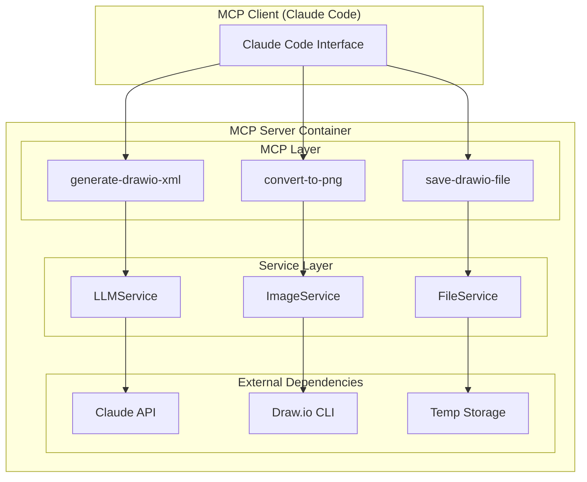

# 設計書

## 概要

MCPサーバー移行は、既存のExpress.js Webアプリケーションからコア図表生成機能を抽出し、Model Context Protocol（MCP）サーバーとして再構築することを含みます。この設計は既存のビジネスロジックを維持しながら、インターフェースをMCP標準に適応させ、Claude Codeや他のMCP互換クライアントとの統合を可能にします。

移行では、3つのコアサービス（LLMService、FileService、ImageService）を保持しながら、REST APIエンドポイントをMCPツールに置き換えます。サーバーは簡単なデプロイと配布のためにコンテナ化されます。

## アーキテクチャ

### 高レベルアーキテクチャ



### 技術スタック移行

**移行前（現在）:**
- Node.js + Express.js + TypeScript
- REST APIエンドポイント
- Webベースファイル配信

**移行後（目標）:**
- Python 3.10+ 
- MCP SDK (`mcp[cli]`)
- MCPツールインターフェース
- コンテナベースデプロイ

### サービス層設計

既存のTypeScriptサービスは、同一の機能を維持しながらPythonに移行されます：

1. **LLMService** → Python `LLMService` クラス
2. **FileService** → Python `FileService` クラス  
3. **ImageService** → Python `ImageService` クラス

## コンポーネントとインターフェース

### MCPツールインターフェース

#### 1. generate-drawio-xml ツール

```python
@mcp.tool()
async def generate_drawio_xml(prompt: str) -> dict:
    """
    自然言語記述からDraw.io XMLを生成
    
    Args:
        prompt: 図表の自然言語記述
        
    Returns:
        {
            "success": bool,
            "xml_content": str,
            "error": str | None
        }
    """
```

#### 2. save-drawio-file ツール

```python
@mcp.tool()
async def save_drawio_file(xml_content: str, filename: str = None) -> dict:
    """
    Draw.io XMLコンテンツを一時ファイルに保存
    
    Args:
        xml_content: 有効なDraw.io XMLコンテンツ
        filename: オプションのカスタムファイル名（デフォルトはUUID）
        
    Returns:
        {
            "success": bool,
            "file_id": str,
            "file_path": str,
            "expires_at": str,
            "error": str | None
        }
    """
```

#### 3. convert-to-png ツール

```python
@mcp.tool()
async def convert_to_png(file_id: str = None, file_path: str = None) -> dict:
    """
    Draw.ioファイルをPNG画像に変換
    
    Args:
        file_id: save-drawio-fileからのファイルID（推奨）
        file_path: 直接ファイルパス（代替）
        
    Returns:
        {
            "success": bool,
            "png_file_id": str,
            "png_file_path": str,
            "base64_content": str | None,
            "error": str | None
        }
    """
```

### サービス層コンポーネント

#### LLMService (Python)

```python
class LLMService:
    def __init__(self, api_key: str):
        self.client = anthropic.Anthropic(api_key=api_key)
        self.cache: Dict[str, CacheEntry] = {}
        
    async def generate_drawio_xml(self, prompt: str) -> str:
        """自然言語プロンプトからDraw.io XMLを生成"""
        
    def _build_system_prompt(self) -> str:
        """Draw.io XML生成用システムプロンプトを構築"""
        
    def _extract_xml_from_response(self, response: str) -> str:
        """Claudeの応答からXMLコンテンツを抽出"""
        
    def _validate_drawio_xml(self, xml: str) -> None:
        """Draw.io XML構造を検証"""
```

#### FileService (Python)

```python
class FileService:
    def __init__(self, temp_dir: str = "./temp"):
        self.temp_dir = Path(temp_dir)
        self.temp_files: Dict[str, TempFile] = {}
        
    async def save_drawio_file(self, xml_content: str, filename: str = None) -> str:
        """Draw.io XMLを一時ファイルに保存"""
        
    async def get_file_path(self, file_id: str) -> str:
        """IDによるファイルパス取得"""
        
    async def cleanup_expired_files(self) -> None:
        """期限切れ一時ファイルのクリーンアップ"""
```

#### ImageService (Python)

```python
class ImageService:
    def __init__(self, drawio_cli_path: str = "drawio"):
        self.drawio_cli_path = drawio_cli_path
        self.cli_availability_cache: Optional[Dict] = None
        
    async def generate_png(self, drawio_file_path: str) -> ImageGenerationResult:
        """CLIを使用してDraw.ioファイルからPNGを生成"""
        
    async def is_drawio_cli_available(self) -> bool:
        """Draw.io CLIの可用性をチェック"""
```

## データモデル

### コアデータ構造

```python
@dataclass
class TempFile:
    id: str
    original_name: str
    path: str
    file_type: Literal["drawio", "png"]
    created_at: datetime
    expires_at: datetime

@dataclass
class CacheEntry:
    xml: str
    timestamp: float
    expires_at: float

@dataclass
class ImageGenerationResult:
    success: bool
    image_file_id: Optional[str] = None
    error: Optional[str] = None

class LLMError(Exception):
    def __init__(self, message: str, code: str, original_error: Optional[Exception] = None):
        super().__init__(message)
        self.code = code
        self.original_error = original_error
```

### 設定モデル

```python
@dataclass
class MCPServerConfig:
    anthropic_api_key: str
    temp_dir: str = "./temp"
    drawio_cli_path: str = "drawio"
    cache_ttl: int = 3600  # 1 hour
    max_cache_size: int = 100
    file_expiry_hours: int = 24
    cleanup_interval_minutes: int = 60
```

## エラーハンドリング

### エラー分類

システムはTypeScript実装からの既存のエラー分類を維持します：

```python
class LLMErrorCode(Enum):
    API_KEY_MISSING = "API_KEY_MISSING"
    CONNECTION_ERROR = "CONNECTION_ERROR"
    RATE_LIMIT_ERROR = "RATE_LIMIT_ERROR"
    QUOTA_EXCEEDED = "QUOTA_EXCEEDED"
    INVALID_RESPONSE = "INVALID_RESPONSE"
    INVALID_XML = "INVALID_XML"
    TIMEOUT_ERROR = "TIMEOUT_ERROR"
    UNKNOWN_ERROR = "UNKNOWN_ERROR"
```

### エラーレスポンス形式

すべてのMCPツールは一貫したエラーレスポンスを返します：

```python
{
    "success": False,
    "error": "Human-readable error message",
    "error_code": "ERROR_CODE",
    "details": {
        "original_error": "Technical details",
        "timestamp": "2024-01-01T00:00:00Z"
    }
}
```

### グレースフル・デグラデーション

- **Draw.io CLI利用不可**: インストール手順付きの明確なエラーメッセージを返す
- **Claude APIエラー**: 分類して適切なユーザー向けメッセージを提供
- **ファイルシステムエラー**: 権限とディスク容量の問題を適切に処理
- **ネットワークタイムアウト**: 指数バックオフによるリトライロジックを実装

## テスト戦略

### 単体テストフレームワーク

Python単体テストに`pytest`を使用：

```python
# Test structure
tests/
├── unit/
│   ├── test_llm_service.py
│   ├── test_file_service.py
│   └── test_image_service.py
├── integration/
│   ├── test_mcp_tools.py
│   └── test_end_to_end.py
└── fixtures/
    ├── sample_prompts.py
    └── sample_xml.py
```

### テストカテゴリ

1. **単体テスト**
   - サービス層機能
   - エラーハンドリングシナリオ
   - キャッシュ動作
   - XML検証

2. **統合テスト**
   - MCPツール相互作用
   - サービス統合
   - ファイルシステム操作
   - 外部API呼び出し（モック）

3. **エンドツーエンドテスト**
   - 完全ワークフロー: プロンプト → XML → PNG
   - エラーシナリオ
   - コンテナ機能

### モック戦略

- **Claude API**: 一貫したテストのためのモックレスポンス
- **Draw.io CLI**: サブプロセス呼び出しのモック
- **ファイルシステム**: 一時ディレクトリの使用
- **時間依存関数**: キャッシュテスト用のdatetimeモック

## コンテナ設計

### マルチステージDockerfile

```dockerfile
# Build stage
FROM python:3.10-slim as builder
WORKDIR /app
COPY requirements.txt .
RUN pip install --no-cache-dir -r requirements.txt

# Runtime stage  
FROM node:18-alpine as runtime
RUN apk add --no-cache python3 py3-pip
RUN npm install -g @drawio/drawio-desktop-cli

COPY --from=builder /usr/local/lib/python3.10/site-packages /usr/local/lib/python3.10/site-packages
COPY src/ /app/src/
WORKDIR /app

EXPOSE 8000
CMD ["python", "-m", "src.server"]
```

### コンテナ最適化

- **ベースイメージ**: 最小サイズのための`python:3.10-alpine`
- **マルチステージビルド**: ビルドとランタイムステージの分離
- **レイヤーキャッシュ**: ビルド速度のためのレイヤー順序最適化
- **セキュリティ**: 非rootユーザー実行
- **ヘルスチェック**: 組み込みヘルス監視

### リソース要件

- **メモリ**: 最小256MB、推奨512MB
- **CPU**: 最小0.5コア、推奨1コア  
- **ストレージ**: 一時ファイルとキャッシュ用1GB
- **ネットワーク**: Claude API用アウトバウンドHTTPS

## デプロイ設定

### 環境変数

```bash
# Required
ANTHROPIC_API_KEY=sk-ant-...

# Optional
TEMP_DIR=/app/temp
DRAWIO_CLI_PATH=drawio
CACHE_TTL=3600
MAX_CACHE_SIZE=100
FILE_EXPIRY_HOURS=24
LOG_LEVEL=INFO
```

### Docker Compose設定

```yaml
version: '3.8'
services:
  mcp-server:
    build: .
    environment:
      - ANTHROPIC_API_KEY=${ANTHROPIC_API_KEY}
    volumes:
      - temp_data:/app/temp
    healthcheck:
      test: ["CMD", "python", "-c", "import requests; requests.get('http://localhost:8000/health')"]
      interval: 30s
      timeout: 10s
      retries: 3
    restart: unless-stopped

volumes:
  temp_data:
```

### Health Monitoring

The server includes health check endpoints:

- **Liveness**: Basic server responsiveness
- **Readiness**: All services initialized and ready
- **Dependencies**: Claude API connectivity, Draw.io CLI availability

## Performance Considerations

### Caching Strategy

- **LLM Response Cache**: In-memory cache with TTL and size limits
- **CLI Availability Cache**: 5-minute cache to avoid repeated checks
- **File Metadata Cache**: In-memory tracking of temporary files

### Resource Management

- **Memory**: Bounded cache sizes prevent memory leaks
- **Disk**: Automatic cleanup of expired temporary files
- **Network**: Connection pooling for Claude API calls
- **CPU**: Async/await patterns for non-blocking operations

### Scalability

- **Stateless design**: No persistent state between requests
- **Horizontal scaling**: Multiple container instances supported
- **Load balancing**: Standard HTTP load balancing compatible
- **Resource isolation**: Container-based deployment ensures isolation

## Security Considerations

### API Security

- **API Key Management**: Environment variable configuration
- **Input Validation**: Strict validation of all MCP tool parameters
- **Output Sanitization**: Safe handling of generated XML content
- **Rate Limiting**: Built-in protection against abuse

### Container Security

- **Non-root execution**: Container runs as non-privileged user
- **Minimal attack surface**: Alpine-based minimal container
- **No sensitive data**: Temporary files only, no persistent secrets
- **Network isolation**: Only required outbound connections

### File System Security

- **Temporary file isolation**: Scoped to container temp directory
- **Automatic cleanup**: Prevents disk space exhaustion
- **Path validation**: Prevents directory traversal attacks
- **Permission management**: Restricted file system access